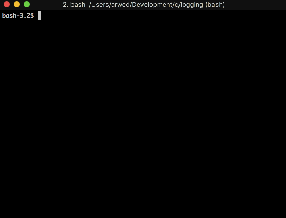

[](https://drone.metthub.de/Pfeifenjoy/logging.h)

# Logging.h

A small library which implements logging.



## Usage
E.g:
```c
#include "logging/logging.h"

int main(const int argc, const char **argv) {
	println_debug("42");    // -> [DEBUG] 42
	println_error("42");    // -> [ERROR] 42
	println_info("42");     // -> [INFO]  42
	println_warn("42");     // -> [WARN]  42
}
```

## Installation

The package can be installed via source with the following commands.

```bash
git clone https://gitea.metthub.de/Pfeifenjoy/logging.h.git
cd logging.h
mkdir build && cd build
cmake -DCMAKE_BUILD_TYPE=Release ..
cmake --build . --target install
```

## Usage with Cmake

You can use logging.h with cmake as follows. Thereby replace `<target>` with your target.

```cmake
find_package(logging 0.0.2 EXACT REQUIRED)
target_link_libraries(<target> PRIVATE logging::logging-static)
```
